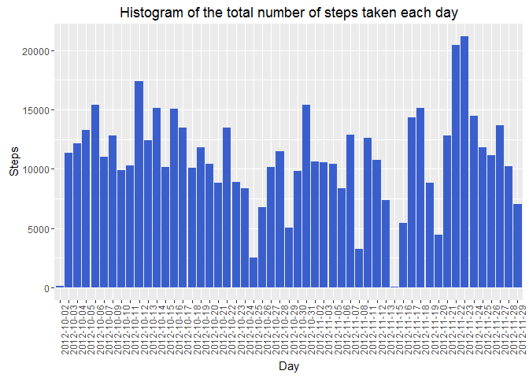

Setting up the defaults:

    knitr::opts_chunk$set(echo = TRUE, results = "asis")

Code for downloading and reading in the dataset:

    if(!file.exists("getdata-projectfiles-UCI HAR Dataset.zip")) {
            temp <- tempfile()
            download.file("http://d396qusza40orc.cloudfront.net/repdata%2Fdata%2Factivity.zip",temp)
            unzip(temp)
            unlink(temp)
    }
    rawData <- read.csv("activity.csv", stringsAsFactors = FALSE)
    dim(rawData)

\[1\] 17568 3

Code for preprocessing the data (Removing NAs):

    noNAData <- rawData[complete.cases(rawData), ]
    dim(noNAData)

\[1\] 15264 3

### Q1: What is mean total number of steps taken per day?

#### Ans:

Histogram of the total number of steps taken each day.

    library(ggplot2)

    ## Warning: package 'ggplot2' was built under R version 3.2.4

    ggplot(noNAData, aes(as.factor(date),steps))+geom_bar(fill="royalblue3", stat="identity")+xlab("Day") + ylab("Steps")+ggtitle("Histogram of the total number of steps taken each day")+ theme(axis.text.x = element_text(angle = 90, hjust = 1))

<!-- -->

    meanFreq <- as.integer(mean(aggregate(steps~date,noNAData, FUN=sum)$steps))

Mean number of steps taken each day is 10766.

    medianFreq <- median(aggregate(steps~date,noNAData, FUN=sum)$steps)

Median number of steps taken each day is 10765.

### Q2: What is the average daily activity pattern?

#### Ans:

    q2 <- noNAData
    q2 <- aggregate(steps~interval, q2, FUN=mean)
    plot(q2$steps ~ q2$interval, type="l", xlab="Date", ylab="Average Steps per Day (5-mins interval")

<!-- -->

Code to look for the maximum number of steps:

    maxSteps <- q2[q2$steps==max(q2$steps), ]
    q2 <- NULL

The 5-minute interval 835, on average across all the days in the
dataset, contains the maximum number of steps (206.1698113).

### Q3: Imputing missing values

#### Ans:

Code to calculate the total number of missing values in the dataset.

    numNA <- nrow(rawData) - nrow(noNAData)

The total number of rows with NAs in the dataset is 2304.

The simple strategy that I used in imputing the data is that I used the
average steps taken for that specific interval in all of the data set
and assign it to the missing value(s). The code for this strategy is the
following:

    imputedData <- rawData
    #The mean for that 5-minute interval
    meanForNA <- aggregate(steps~interval,imputedData, FUN=mean)
    for(i in 1:nrow(imputedData)){
      if(is.na(imputedData[i,c("steps")])){
        imputedData[i,c("steps")] <- meanForNA[meanForNA$interval==imputedData[i,c("interval")], c("steps")]
      }
    }

Code to Show Histogram of the total number of steps taken each day after
missing values are imputed.

    ggplot(imputedData,aes(as.factor(date),steps))+geom_bar(fill="royalblue3", stat="identity")+xlab("Day") + ylab("Steps")+ggtitle("Histogram of the Total Number of Steps Taken Each Day (Imputed Data)")+ theme(axis.text.x = element_text(angle = 90, hjust = 1))

<!-- -->

    newmeanFreq <- as.integer(mean(aggregate(steps~date,imputedData, FUN=sum)$steps))
    newmedianFreq <- as.integer(median(aggregate(steps~date,imputedData, FUN=sum)$steps))

The new mean of the imputed data is 10766 steps compared to the old mean
of 10766 steps. That creates a difference of 0 steps on average per day.

The new median of the imputed data is 10766 steps compared to the old
median of 10765 steps. That creates a difference of 1 steps for the
median.

This shows that the overall shape of the distribution has not changed
after applying the method in imputing the data.

### Q4: Are there differences in activity patterns between weekdays and weekends?

#### Ans:

Code to Create a new factor variable in the dataset with two levels -
"weekday" and "weekend" indicating whether a given date is a weekday or
weekend day.

    weekDayEnd <- data.frame("dayType"=character(0))
    weekDayEnd <- NULL

    #Check wether the day is a weekday or weekend (Saturday)
    weekInd <- function(day){
      if (weekdays(day)=="Saturday") {
        out <- "Weekend" 
      } else {
        out <- "Weekday" 
      }
      out
    }

    for (i in 1:nrow(imputedData)){
      date <- imputedData[i,c("date")]
      newObs <- data.frame("dayType"= weekInd(as.Date(date)))
      weekDayEnd <- rbind(weekDayEnd, newObs)
    }
    #------------------------------------------------------------

    #Add the day type column in the data set
    imputedData <- cbind(imputedData, weekDayEnd)

Panel plot comparing the average number of steps taken per 5-minute
interval across weekdays and weekends.

    averageWeekDayEnd<-aggregate(steps~interval + dayType, imputedData, FUN=mean)
    ggplot(averageWeekDayEnd,aes(interval,steps, color=dayType))+geom_line()+facet_wrap(~dayType, ncol=1)+xlab("5-min Interval")+ylab("Steps")+guides(fill=FALSE)

<!-- -->
